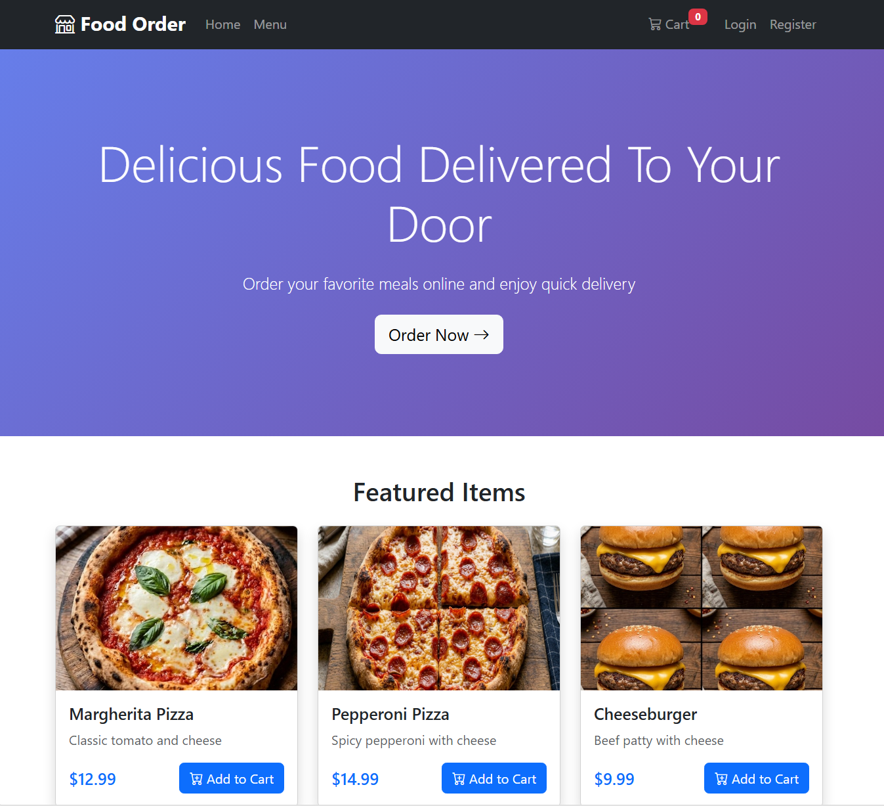

# 🍔 Food Ordering System

<p align="center">
    
</p>

Applicazione web sviluppata con **ASP.NET Core MVC**, **Entity Framework
Core** e **SQL Server** per simulare un sistema di ordinazione online.

L'obiettivo del progetto è consolidare lo sviluppo di applicazioni web
complete utilizzando il pattern MVC, la persistenza dei dati con Entity
Framework Core e la gestione delle sessioni utente.

> 🚧 **Progetto attualmente in sviluppo.**

------------------------------------------------------------------------

# Tecnologie utilizzate

## Backend

-   ASP.NET Core MVC
-   Entity Framework Core
-   SQL Server
-   C#
-   Session Authentication

## Frontend

-   Razor Views
-   HTML5
-   CSS3
-   Bootstrap
-   JavaScript

------------------------------------------------------------------------

# Funzionalità implementate

## Utenti

-   Registrazione
-   Login
-   Gestione sessione
-   Profilo utente

## Catalogo

-   Visualizzazione prodotti
-   Ricerca e filtri
-   Categorie

## Ordini

-   Carrello
-   Checkout
-   Storico ordini
-   Dettaglio ordini

## Amministrazione

-   Gestione prodotti
-   Gestione categorie

------------------------------------------------------------------------

# Architettura

Il progetto segue il pattern MVC.

``` text
Controllers
│
├── Account
├── Home
├── Order
└── Product

Models
│
├── Entities
├── ViewModels
└── DbContext

Views
│
├── Account
├── Home
├── Orders
└── Products

wwwroot
│
├── css
├── js
└── images
```

------------------------------------------------------------------------

# Database

Il progetto utilizza **SQL Server** tramite Entity Framework Core.

Entità principali:

-   User
-   Product
-   Category
-   Order
-   OrderDetail

------------------------------------------------------------------------

# Installazione

## 1. Clonare il repository

``` bash
git clone https://github.com/AleDegia/food-ordering-system.git
```

## 2. Configurare la connection string

Aggiornare `appsettings.json` con il proprio server SQL Server.

## 3. Applicare le migrazioni

``` bash
dotnet ef database update
```

## 4. Avviare il progetto

``` bash
dotnet run
```

------------------------------------------------------------------------

# Obiettivi del progetto

Questo progetto nasce per approfondire:

-   ASP.NET Core MVC
-   Entity Framework Core
-   Gestione delle sessioni
-   CRUD completi
-   Modellazione del database
-   Applicazioni web lato server

------------------------------------------------------------------------

# Miglioramenti previsti

-   Password hashing
-   ASP.NET Core Identity
-   DTO e Service Layer
-   Validazioni avanzate
-   Unit Test
-   Docker
-   CI/CD
-   Deploy su Azure
